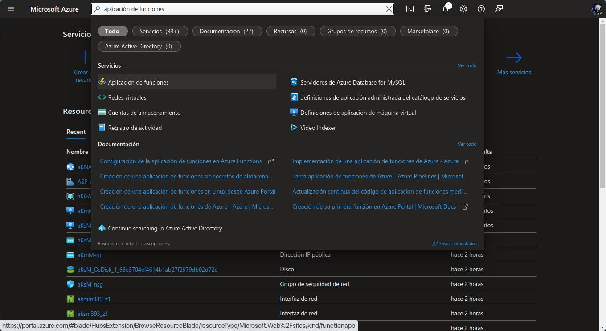
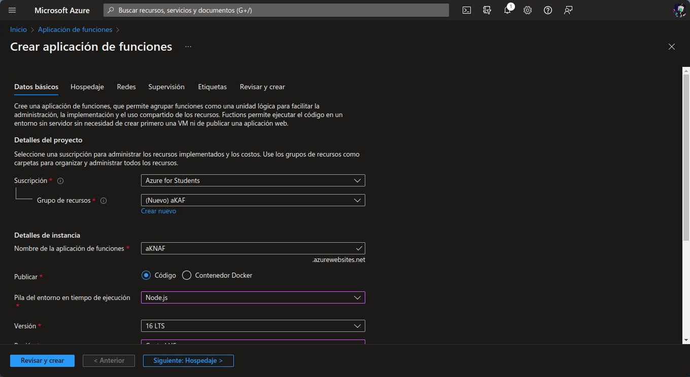
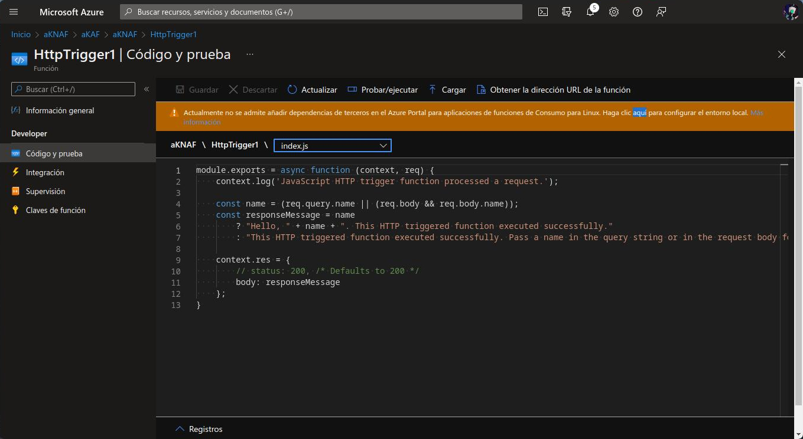
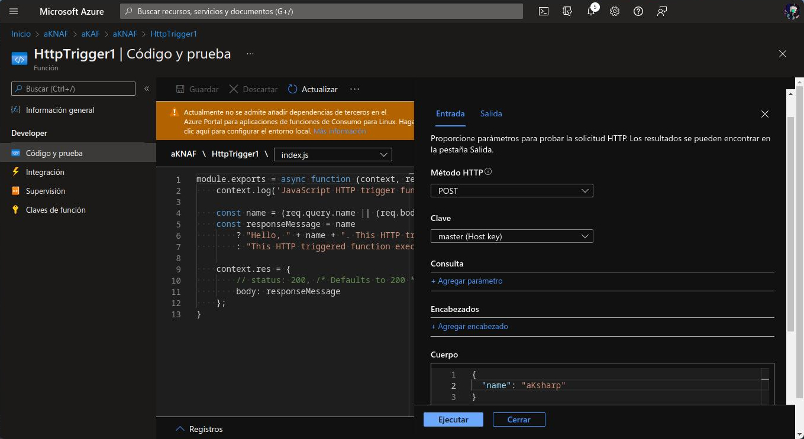
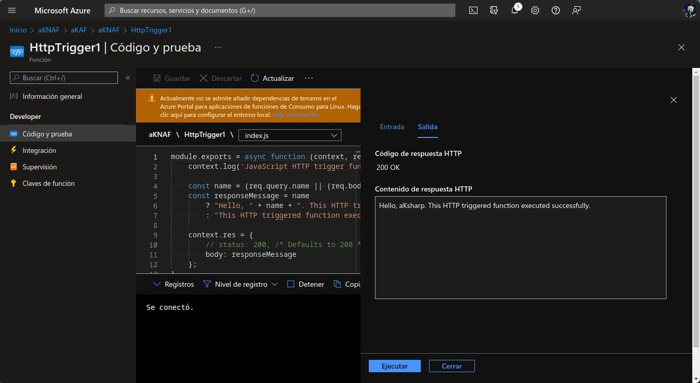
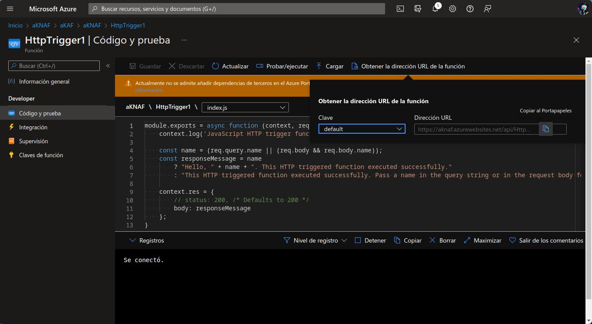

# Uso de Azure Funtions


Recordar que es necesario tener una cuenta de Azure con una subscripción para acceder desd el [portal de Azure](https://portal.azure.com/).

Para crear una función, se debe crear un recurso en Azure Functions. Para esto es necesario llenar el formulario:

## Datos basicos
Es necesario definer la suscripción a Azure a usar, el grupo de recursos, el nombre del recurso, la pila del entorno (en este caso **Node.js**), el sistema operativo (en este caso **Linux**)...


# Funciones

Despues de crear el recurso, en la sección de **Funciones** se debe crear una función (en este caso HTML trigger) la cual se creara en node js.


## Probar/ejecutar la función
Entre las opciones que presenta Azure Functions, se encuentra la opción de **Probar/ejecutar**, dependiendo de los datos que se le indiquen al archivo ```index.js```, es necesario que se definan los parámetros en la sección **Cuerpo**.


Si no hay problemas, la sección **Probar/ejecutar** debe mostrar una pantalla con el resultado de la ejecución y la sección **Registros** debe mostrar un mensaje de que la función se ejecuto correctamente.


## URL de la función
Otra opción es la de **Obtener la dirección URL de la función**, esta opción permite obtener la dirección URL de la función que se creo.

